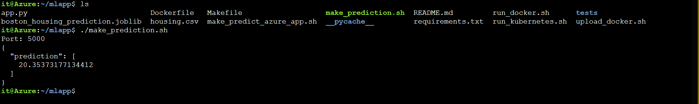
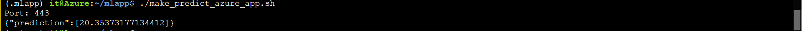
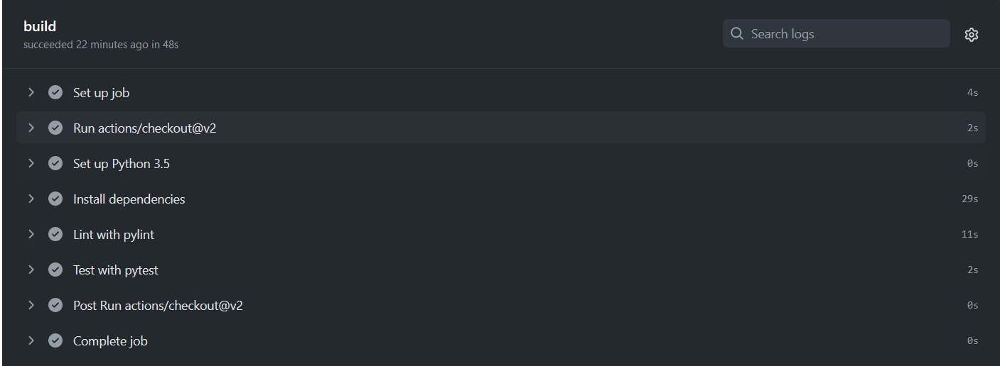
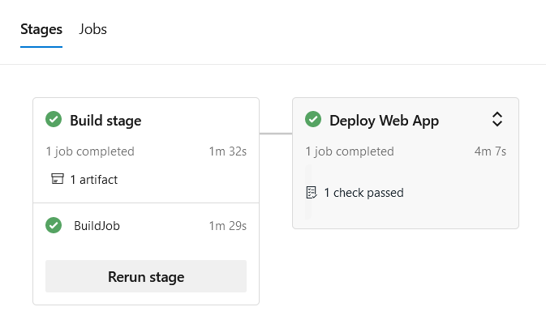
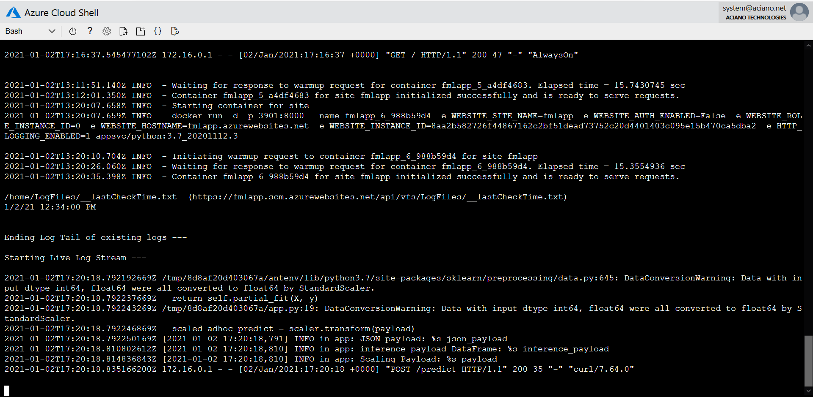

# Overview
Flash Machine Learning Application
This project is a Python-based machine learning application using the Flask web framework, with a deployable Machine Learning Microservice API using Azure DevOps pipelines and GitHub repo with continuous delivery.

We are using the sklearn model that has been trained to predict housing prices in Boston according to several features, such as average rooms in a home and data about highway access, teacher-to-pupil ratios, and so on. 

## Project Plan

* Trello board: https://trello.com/b/mUbT2FcY/flask-ml-app
* Project plan: https://docs.google.com/spreadsheets/d/1_ludRiFuehc02ILnTAxcOu0h7gAZlBLX_vyzvAXeHrw/edit?usp=sharing

## Instructions

* Architectural Diagram 


<TODO:  Instructions for running the Python project.  How could a user with no context run this project without asking you for any help.  Include screenshots with explicit steps to create that work. Be sure to at least include the following screenshots:
Steps to configure ML Python App on Azure:
1. Login Azure Portal & open Cloud Shell
2. Add SSH Key on GitHub from cloud shell run
ssh-keygen -t ed25519 -C "youremailaddress@example.com"
3. Go to Github settings -> Add SSH and save the input file generated from above command
4. Clone Repo using git clone 
5. Run command make setup to create environment
6. Activate environment using command source ~/.mlapp/bin/activate
5. Run command ``` make install ```- to install requirements
6. Run command ``` make lint ```- to check code errors
7. Run command ``` make test - to test functions
8. To run the app use ``` python3 app.py ```
9. Open another cloud shell session from the button.
10. Give rights to file using ```chmod +x make_prediction.sh ``` and then run ``` .\make_predisction.sh ```
11. It will display output like this 

12. To upload app on the Azure Web App use command ``` az webapp up -n fmlapp ```
13. Edit the file make_predict_azure_app.sh with the webapp name you provided above and then save file.
14. Now you provide the permission to the make_predict_azure_app.sh file and then run ``` ./make_predict_azure_app.sh ``` to verify prediction result from Azure WebApp

15. Check log trail via both options
   - Run command ``` az webapp log tail ```
   - Open this url in browser https://fmlapp.scm.azurewebsites.net/api/logs/docker

Steps to configure Continues Integrattion with Github Actions
1. Enable Github Actions and clock setup new workflow
2. Modify the yml file to support Makefile 
```
name: ML APP

on: [push]

jobs:
  build:

    runs-on: ubuntu-latest

    steps:
    - uses: actions/checkout@v2
    - name: Set up Python 3.5
      uses: actions/setup-python@v1
      with:
        python-version: 3.5
    - name: Install dependencies
      run: |
        make install
    - name: Lint with pylint
      run: |
        make lint
    - name: Test with pytest
      run: |
        make test

```
3. Edit code to see if CI is successful


Steps to configure Continues delivery with Github + Azure Pipelines
1. Create project in Azure DevOps
2. Go to Project settings and create new service connections with selected subscription
3. Go to pipelines of project and create new pipelines
4. Select where your code is, in our case its GitHub
5. Select the repo
6. Authorize GitHub to use the repo
7. Select "Python web app for Linux"
8. Edit pipelines for lint and test (you can also use make all install of these three make lines
```
    - script: |
        python -m venv antenv
        source antenv/bin/activate
        make install
        make lint
        make test
      workingDirectory: $(projectRoot)
      displayName: "Install, lint and Test"
```
9. Save and Run YAML
10. Once successful you will see the results like this

13. Test sklearn predict service via cloud shell


```bash
(.mlapp) it@Azure:~/mlapp$ ./make_predict_azure_app.sh
Port: 443
{"prediction":[20.35373177134412]}
```

* Output of streamed log files from deployed application



## Enhancements

This project could be extended to any pre-trained machine learning model, such as those for image recognition and data labeling.

## Demo 

You can view the demo to configure the app from the Youtube @ https://www.youtube.com/watch?v=Cgw54ow4KwI


